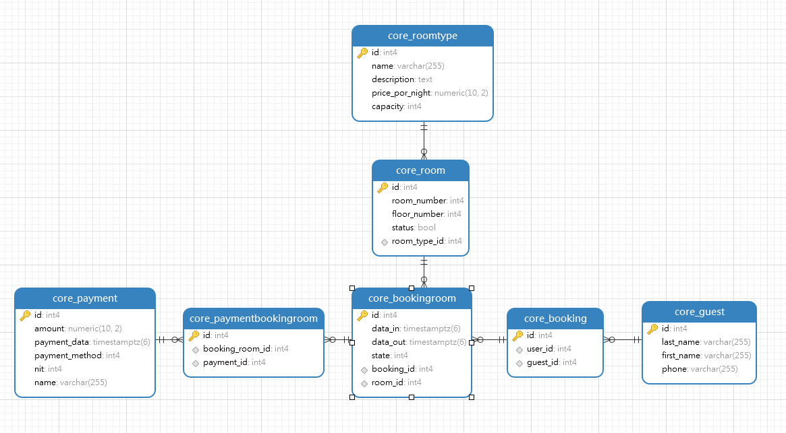

# Hotel Booking Python/Django CRU

## Description

This is a CRUD base for Python/Django. It relies only in HTML forms and submits to persist data.

## Modelo de la db



## Postman test

[Documento de pruevas postman](https://documenter.getpostman.com/view/1064965/2sA2r54RSN)

## Installation

Clone repository:

```
> clone ...
```

Iniciar los contenedores Docker utilizando el comando:

```
docker compose up
```

## Configure the App

Acceder al contenedor Docker con nombre 'web':

```
docker exec -it web bash
```

Run the following commands in the Docker container 'web' shell (bash) to configure:

```
> python ./manage.py makemigrations
> python ./manage.py makemigrations core
> python ./manage.py migrate
> python ./manage.py createsuperuser

```

## And navigate to Hotel API address:

```
http://localhost:8000/api/
```
