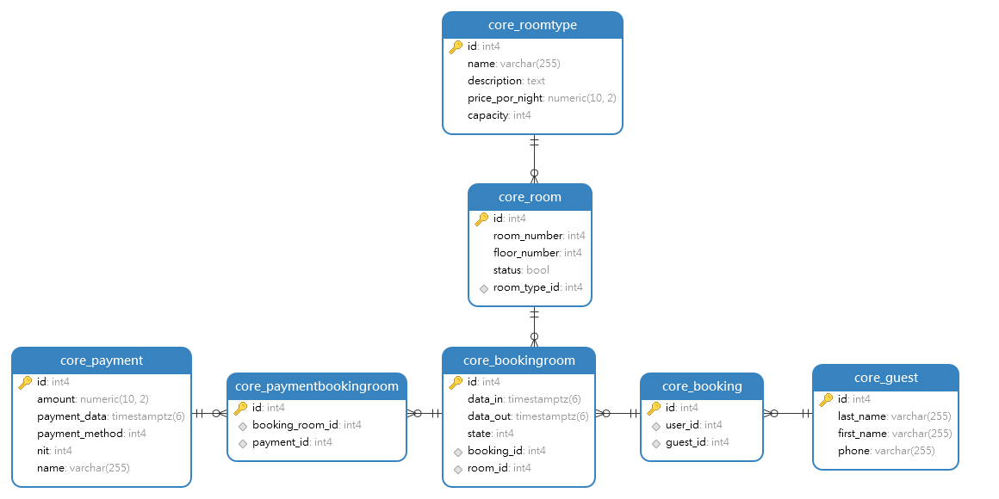

# Hotel Booking Python/Django CRUD

## Description

Este proyecto es una API de gestión hotelera utilizando Django Rest Framework (DRF) y PostgreSQL. El objetivo es aprender a crear API con Django y el alcance incluye la gestión de habitaciones, huespedes, reservas y reservas de habitacion y pago por el hospedaje y seguridad mediante token.

## Modelo de la db



## Postman test

En el siguiente documento de Postman, encontrarás una explicación de cada endpoint, incluyendo el propósito y la funcionalidad específica que desempeñan en el sistema. Además, se proporcionarán ejemplos y casos de uso relevantes para cada endpoint.

[Documento de pruevas postman](https://documenter.getpostman.com/view/1064965/2sA2r54RSN)

## Instalacion

Clone repository:

```
> clone ...
```

Iniciar los contenedores Docker utilizando el comando:

```
docker compose up
```

## Configuracion de la app

Acceder al contenedor Docker con nombre 'web':

```
docker exec -it web bash
```

Ejecute los siguientes comandos en el shell del contenedor  'web' Docker (bash) para configurar:

```
> python ./manage.py makemigrations
> python ./manage.py makemigrations core
> python ./manage.py migrate
> python ./manage.py createsuperuser

```

## Navigate aL Url de la API:

Acceder a la siguiente url para crear un nuevo usuario y obtener un token para comenzar a usar la API:

```
http://127.0.0.1:8000/api/Create_User
```

Agregar en el header la Authorization con el token del usuario creado:

token 123123234as43sdf345sdfg34453423qweqwe2g
